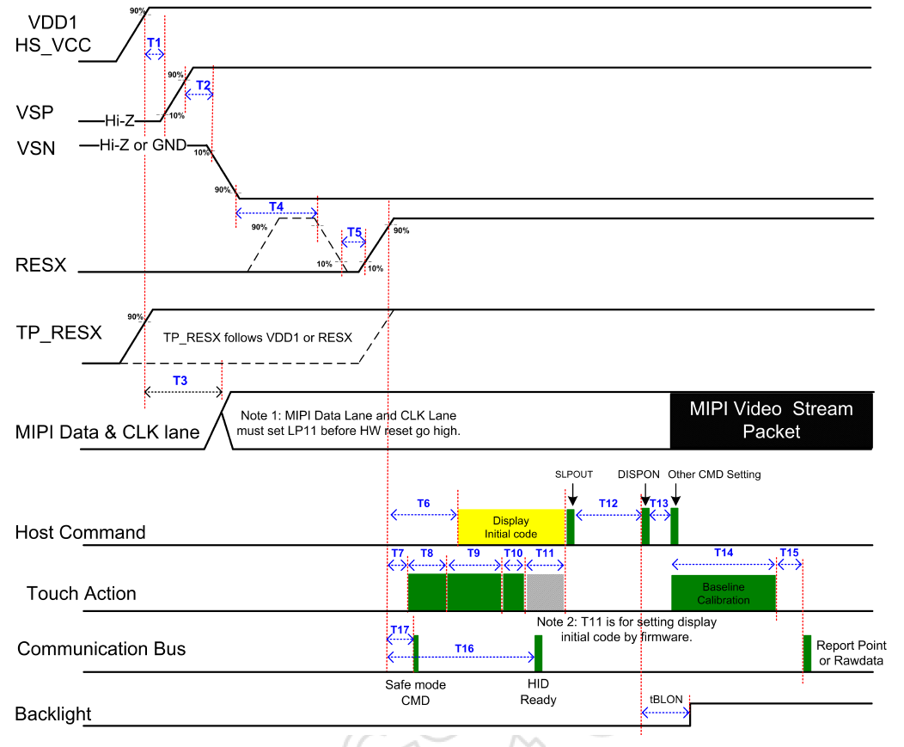
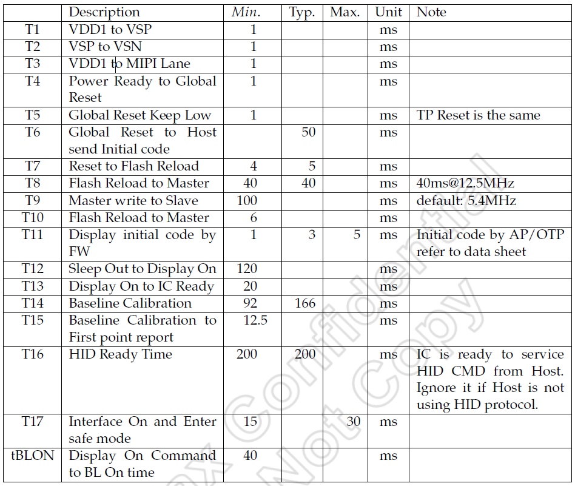

This is the power sequence flowchart of HID firmware.
========================================================================
This is a TDDI IC, which means Touch and Display Driver is integrated in one IC.  
Thus the power sequence of RDDI is different from other touch only ICs: the display power sequence should be ready befor the touch power sequence.  
- The fundamental display power sequence include the VDD1, VSP/VSN and RESX, these pins should be ready before the touch power sequence.   
- TP_RESX is the reset pin of touch, it should be release before HID firmware start to work.   

So, for the HID firmware start to work, items listed above should be ready and wait a bit of time(T16) to let firmware loaded and initialized.  
The power sequence flowchart of HID firmware is shown below.

 

